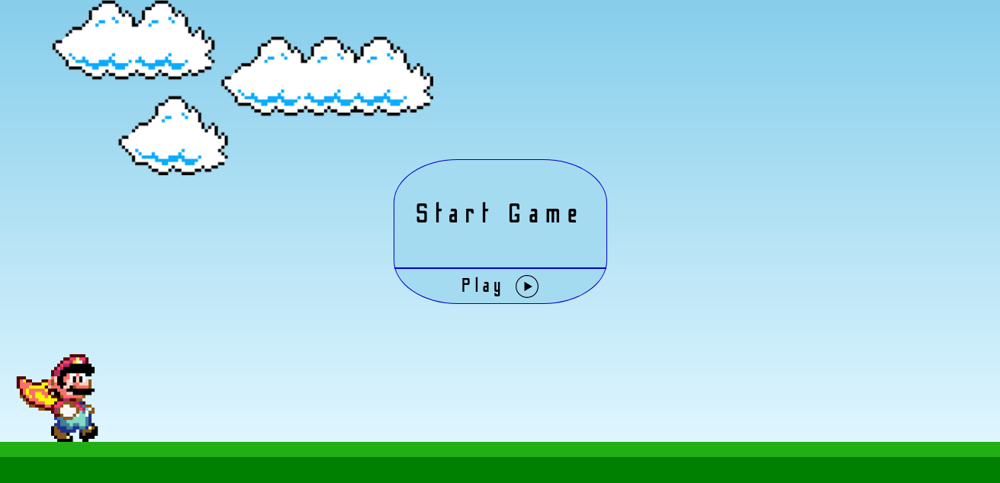
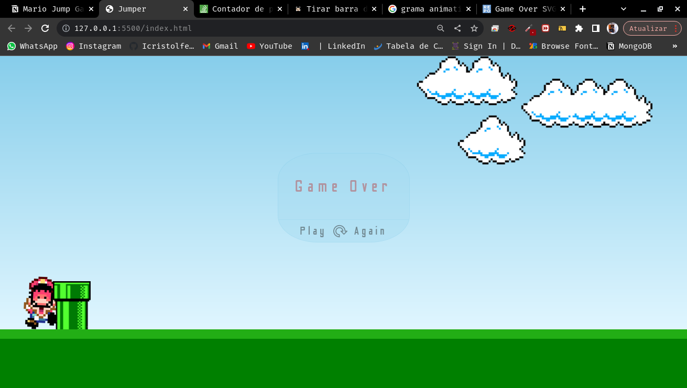

<h1>🔰 Mario Runner. (Html, CSS, Javascript):</h1>

Jogo de obstáculo com o personagem de sucesso Mario, o jogo conta com a animação física de pulo e o encerramento do game ao bater no obstáculo com a possibilidade de reiniciar o jogo, contando  também com música ambiente classica da franquia, audio de pulo e também ao bater em algum obstáculo.

### Ajustes e melhorias

O projeto ainda está em desenvolvimento e as próximas atualizações serão voltadas nas seguintes tarefas:

- [x] Layout
- [x] Som
- [x] Tela de start
- [x] Reload game
- [ ] Contagem de pontos
